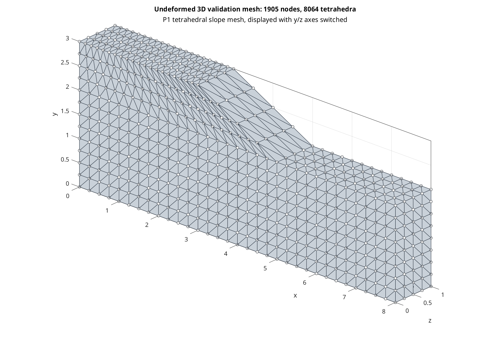
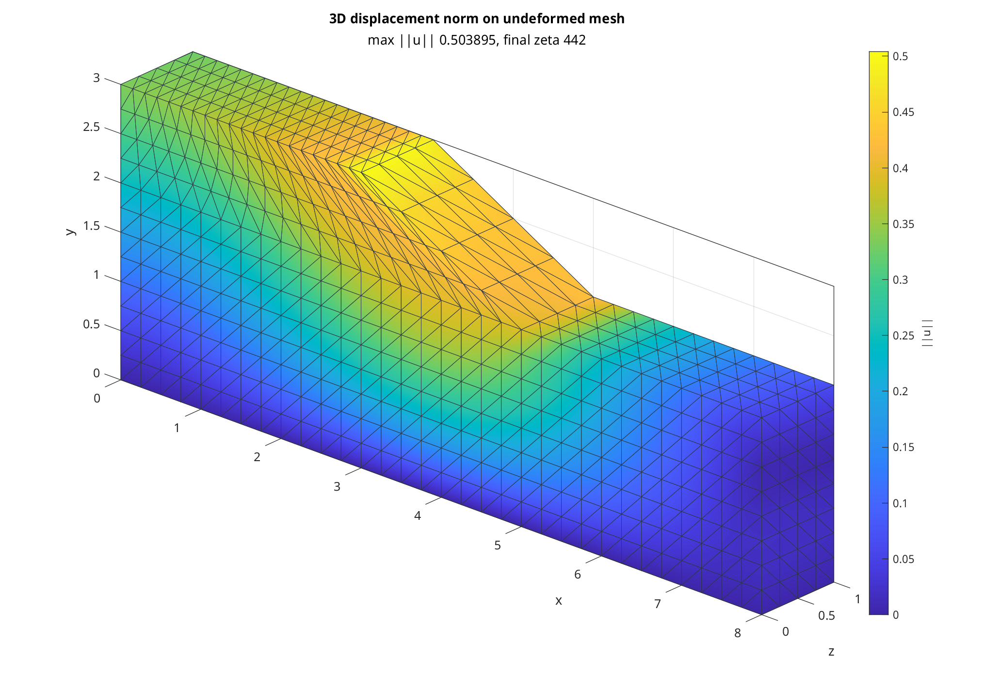
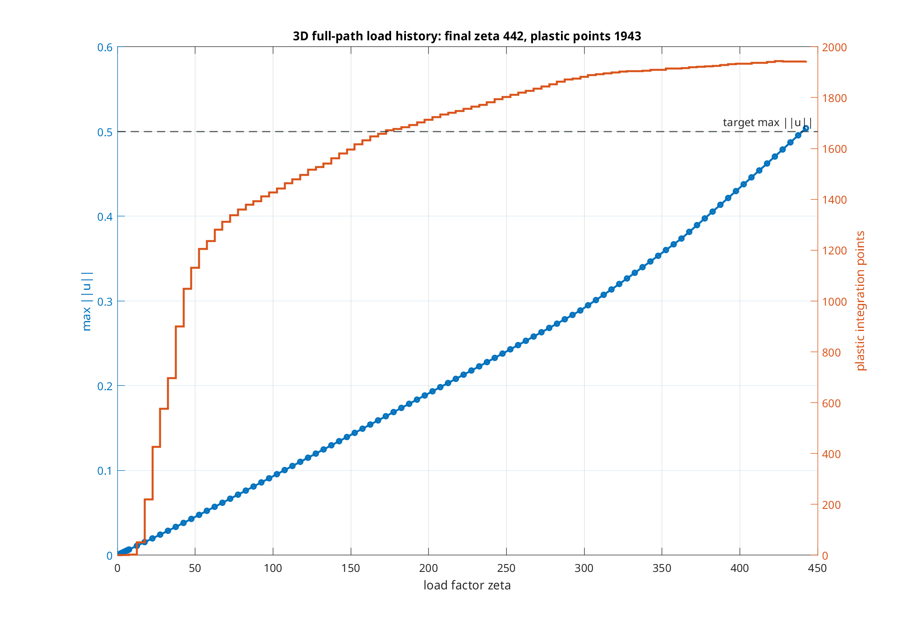
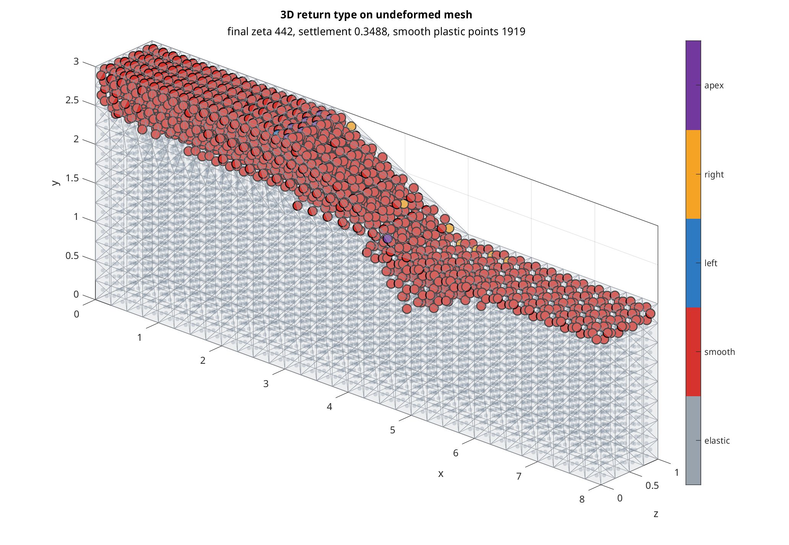
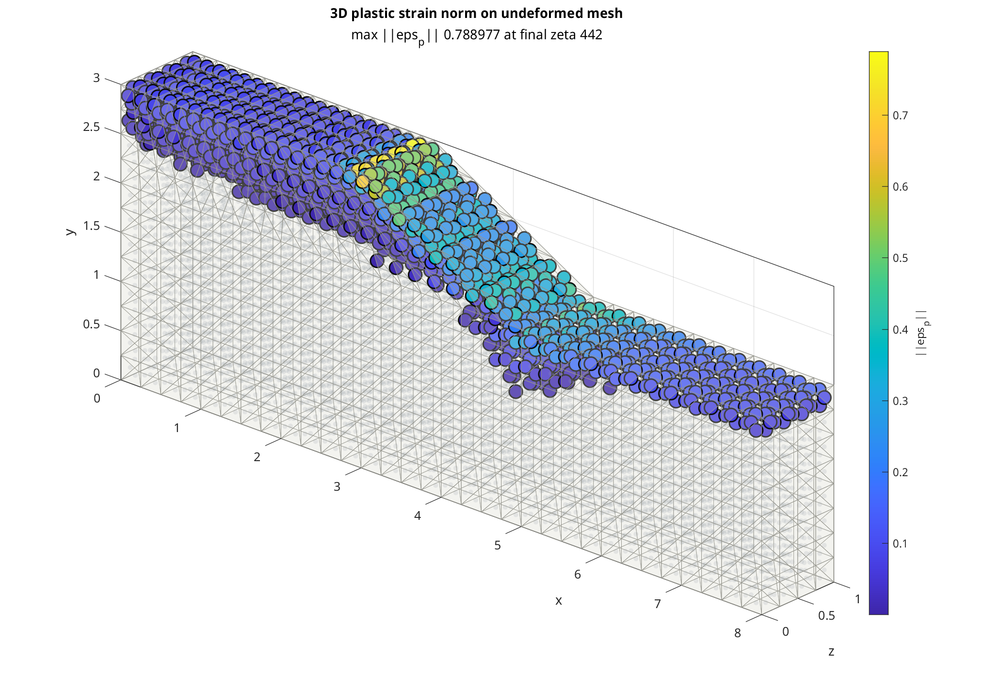
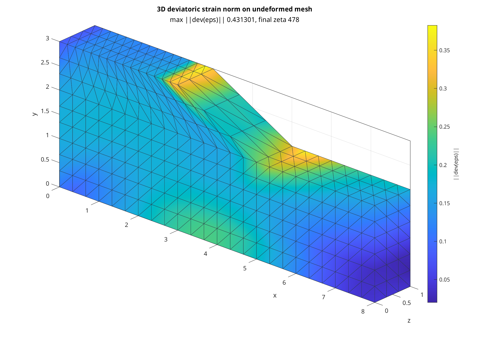
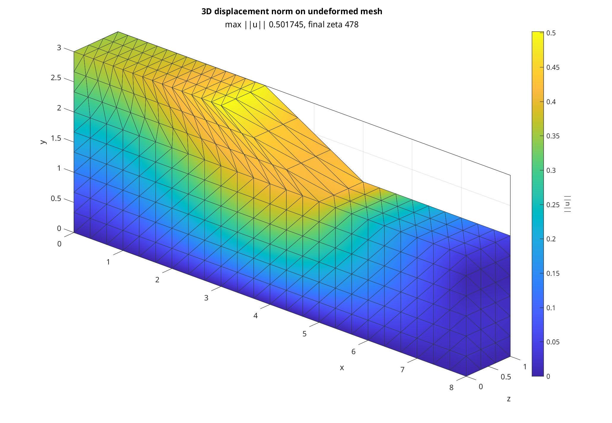

# 3D Mohr-Coulomb MATLAB Export

This directory contains the 3D Mohr-Coulomb MATLAB reference exports used to
validate the standalone SIFEL-shaped C++ port.

The constitutive formulas are ported from:

- Repository: `sysala/slope_stability`
- Commit: `8401cc5`
- Source file: `slope_stability/+CONSTITUTIVE_PROBLEM/constitutive_problem_3D.m`

Public input and output text files use the SIFEL 3D ordering:

```text
[xx, yy, zz, yz, xz, xy]
```

The upstream MATLAB assembly and constitutive formulas use:

```text
[xx, yy, zz, xy, yz, xz]
```

The SIFEL-to-upstream permutation is `[1, 2, 3, 6, 4, 5]` in MATLAB
1-based indexing. The upstream-to-SIFEL permutation is `[1, 2, 3, 5, 6, 4]`.

## Exports

`export_branch_catalog_final.m` writes the deterministic five-branch material
catalog to `replication_output_3d/`. This is the primary small regression set
for exact branch coverage.

`export_loading_process_final.m` writes a self-contained full 3D homogeneous
slope loading path to `replication_output_3d/full/`. This is the integration
point matching dataset for the C++ port. It mirrors the original 2D export
layout: local input data, preprocessing, Newton iterations, load history, mesh
data, final displacement, strain, stress, tangent, plastic strain, return type,
and principal values. The default `N_h = 4` reference export is required to
cover all five implemented return branches.

The full-path mesh is generated by `regular_mesh.m`, adapted from upstream
`+MESH/mesh_P1_3D.m`, and uses the upstream P1 tetrahedral slope geometry. The
load process continues past first plasticity with a smaller load increment until
the requested maximum displacement target is reached. This local export is
driven by the load factor `zeta`; it is not an SSR strength-reduction run with a
separate `lambda` parameter.

The base solver files intentionally mirror `../matlab_export` file by file:
`input_data.m`, `regular_mesh.m`, `preprocessing.m`,
`constitutive_problem.m`, `stiffness_matrix.m`, `newton.m`,
`loading_process.m`, and `transformation.m`. The 3D differences are contained
inside those matching files: tetrahedral geometry, six strain/stress components,
and the upstream 3D return-mapping formulas. The C++ comparison exports convert
only at the text-file boundary between upstream ordering and SIFEL ordering.

The bottom boundary `y = 0` is glued in all three displacement components. The
side boundaries use rollers: `u_x` is fixed at `x = 0` and `x = xmax`, and `u_z`
is fixed at `z = 0` and `z = zmax`.

## Full-Path Plastic State

The generated full-path state is the refined all-branch integration-point
reference. It is produced with:

```sh
matlab -batch "cd('matlab_export_3d'); export_loading_process_final; plot_full_solution_final; close all force; quit force"
```

The exported state in `replication_output_3d/full/` has:

- `8064` integration points and `1905` mesh nodes.
- Refined mesh density `N_h = 4`.
- Final load factor `zeta = 442.5`.
- Final settlement `3.48793576357226631e-01`.
- Final maximum displacement norm `5.03894525098645185e-01`.
- `1943` plastic integration points and `6121` elastic integration points.
- Smooth, left-edge, right-edge, and apex return types all present.
- Maximum plastic strain norm `7.88977217454295943e-01`.
- Post-plastic load increment `5.0`, with target maximum displacement `0.5`.

The same full state is validated by:

```sh
./compare_matlab_export_3d
```

The scalar branch catalog can still be checked explicitly with
`./compare_matlab_export_3d replication_output_3d`.












## MC Surface Coverage

The default full-path matching dataset covers every return branch implemented in
the Tomas/Sysala 3D Mohr-Coulomb algorithm:

| Return type | MC region | Integration points |
| ---: | --- | ---: |
| 0 | elastic, inside yield surface | 6121 |
| 1 | smooth face | 1919 |
| 2 | left edge, `sigma1 = sigma2` | 3 |
| 3 | right edge, `sigma2 = sigma3` | 10 |
| 4 | apex, `sigma1 = sigma2 = sigma3` | 11 |

The exported principal stresses satisfy the active MC conditions to numerical
roundoff:

| Check | Maximum residual |
| --- | ---: |
| Plastic yield residual | 2.30215846386272460e-12 |
| Left-edge `sigma1 - sigma2` gap | 0 |
| Right-edge `sigma2 - sigma3` gap | 0 |
| Apex principal-stress gap | 0 |

Smooth plasticity starts around `zeta = 7.5`, left-edge returns appear around
`zeta = 42.5`, apex returns appear around `zeta = 47.5`, and right-edge returns
appear around `zeta = 52.5`.

## Refinement Check

The refinement comparison can be regenerated with:

```sh
matlab -batch "cd('matlab_export_3d'); export_refinement_sweep_final([3 4]); close all force; quit force"
```

The sweep writes independent full-path exports and plots:

- `replication_output_3d/full_Nh3/` and `matlab_export_3d/images/full_Nh3/`
- `replication_output_3d/full_Nh4/` and `matlab_export_3d/images/full_Nh4/`

Both states were loaded until the maximum displacement norm reached at least
`0.5`. The `N_h = 4` row is the default matching dataset because it covers all
MC branches, including the apex:

| `N_h` | Nodes | Integration points | Final `zeta` | Max `||u||` | Settlement | Plastic points | Return-type mix | Max `||eps_p||` |
| ---: | ---: | ---: | ---: | ---: | ---: | ---: | --- | ---: |
| 3 | 892 | 3402 | 478.5 | 5.01744940941938888e-01 | 3.67207175046440015e-01 | 835 | smooth 830, left 2, right 3, apex 0 | 5.47636887964884744e-01 |
| 4 | 1905 | 8064 | 442.5 | 5.03894525098645851e-01 | 3.48793576357226687e-01 | 1943 | smooth 1919, left 3, right 10, apex 11 | 7.88977217454302160e-01 |

The refined deviatoric strain field keeps the same localization pattern as the
coarser mesh, but the band becomes sharper and the edge/apex return types start
appearing at the larger deformation level on the finest checked mesh.







